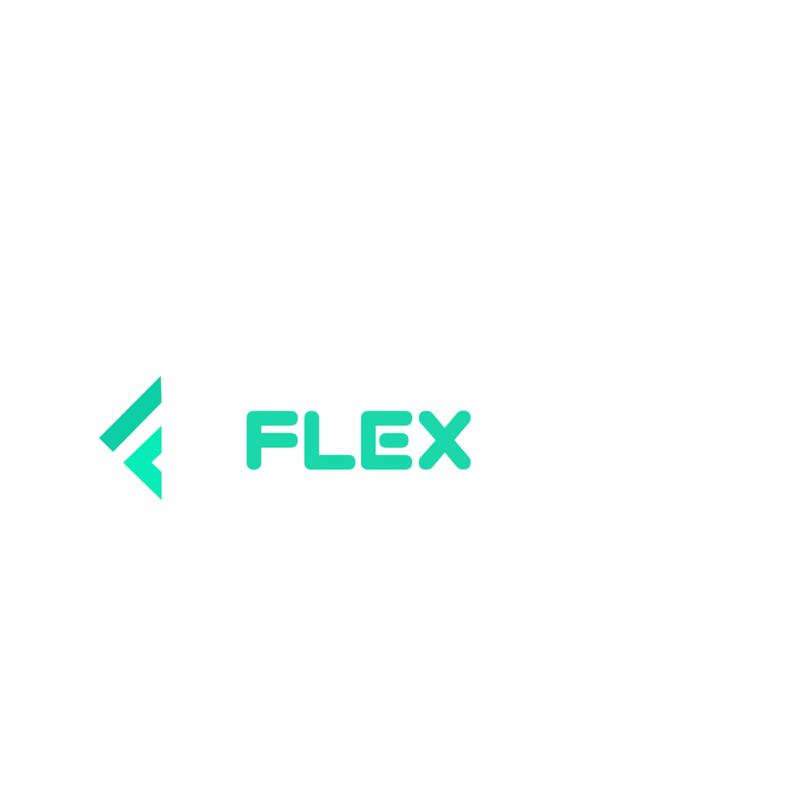

# FlexCode - Unlock the Power of Problem Solving

  

FlexCode is an online platform designed to host and manage coding challenges and problem-solving activities for coding enthusiasts, developers, and programmers. This README provides an overview of the project, its key features, technology stack, and how to get started.

## Table of Contents

- [Overview](#overview)
- [Key Features](#key-features)
- [Unique Features](#unique-features)
- [Technology Stack](#technology-stack)
- [Project Structure](#project-structure)
- [Development Plan](#development-plan)
- [Potential Enhancements](#potential-enhancements)
- [Getting Started](#getting-started)
- [Deployment](#deployment)
- [Contributing](#contributing)
- [License](#license)

## Overview

FlexCode is an online platform that provides a flexible and interactive environment for coding enthusiasts to showcase their coding skills and solve challenges. It is built using a modern tech stack, combining React.js for the frontend, Express.js for the backend, Firebase for user authentication, MongoDB with Mongoose for contest data storage, and JWT for secure authentication.

## Key Features

- **User Authentication**: Secure user registration, login, and password reset using Firebase Authentication with JWT integration.
- **Challenge Management**: Admin users can create and manage coding challenges with input, output, and test case specifications.
- **User Dashboard**: Participants can access their user dashboard, view upcoming contests, participation history, and leaderboard rankings.
- **Real-time Submissions**: Participants can submit their code solutions, and FlexCode will evaluate, score, and display real-time results.
- **Leaderboard**: The platform displays leaderboard rankings for each contest based on users' performance.
- **Code Editor**: A feature-rich code editor with syntax highlighting is provided for writing and submitting code solutions.
- **Blogs**: A blog router is available with interesting articles related to programming.
- **Users Counter**: Tracks how many users visited the website.
- **Problem of the Day**: Features a random problem of the day in an individual section.

## Unique Features

- **Blogs**: Access a blog router with interesting articles related to programming.
- **Users Counter**: Track the number of users who visited the website.
- **Problem of the Day**: Solve a random problem of the day presented in an individual section.

## Technology Stack

- **Frontend**: React.js, HTML, CSS, JavaScript, Tailwind CSS, Axios
- **Backend**: Express.js, Node.js
- **Database**: MongoDB with Mongoose
- **Authentication**: Firebase Authentication with JWT integration
- **Code Evaluation**: CodeMirror environment for securely executing user-submitted code
- **Hosting**: Deployment on a cloud platform like Firebase and Vercel

## Project Structure

The project is organized into the following components:

- **Frontend Pages**: Home Page, Login, Signup, Dashboard, Contest Details, Code Editor
- **Components**: Navbar, Footer, Contest List, Contest Card, Leaderboard, Count Users, etc.

For user authentication and state management, refer to the optional section in the project structure.

## Development Plan

The development process can be divided into the following milestones:

1. Set up the project structure, create the React.js frontend, and integrate Firebase Authentication for user registration and login.
2. Implement user authentication using JWT, enabling access to specific routes based on user roles (admin, participant).
3. Set up MongoDB for storing contest data, including contest details, challenges, and user submissions.
4. Develop the problem-solving creation and challenge management functionality for admin users.
5. Implement the user dashboard, displaying upcoming problems, participation history, and leaderboard rankings.
6. Create the code editor component for users to write and submit code solutions.
7. Perform thorough testing and debugging of the entire application.
8. Deploy the application to a cloud platform for public access.

## Potential Enhancements

After completing the primary features, consider adding the following enhancements to further improve FlexCode:

- **Notifications**: Implement real-time notifications for contest updates and announcements.
- **Code Sharing**: Allow participants to share and discuss their solutions with other users.
- **Code Review**: Introduce a code review feature where users can provide feedback on each other's solutions.

## Getting Started

To get started with FlexCode, follow these steps:

1. Clone this repository.
2. Install the necessary dependencies for the frontend and backend.
3. Configure Firebase and MongoDB for authentication and data storage.
4. Run the application locally for development.

Detailed instructions for each step can be found in the project's documentation.

## Deployment

You can deploy FlexCode to a cloud platform such as Firebase or Vercel for public access. Ensure that you follow the deployment guidelines in the documentation to set up a production environment.

## Creators

Meet the DevGenius team behind FlexCode:

- [Imam Hossain (Team Lead)](https://github.com/ihshadin)
- [Mehedi Hasan Foysal](https://github.com/mehedihasan8)
- [Abu Sayeed](https://github.com/studentabusayeed)
- [Omar Faruq](https://github.com/OmarFaruq967)
- [Jahid Hasan Zarif](https://github.com/Jahidmorol)
- [Nur Mohammad Chowdhury](https://github.com/nmcsakib)

#### Thank you 💝

